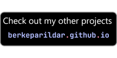

&nbsp;&nbsp;&nbsp;&nbsp;&nbsp;&nbsp;&nbsp;&nbsp;
&nbsp;&nbsp;&nbsp;&nbsp;&nbsp;&nbsp;&nbsp;&nbsp;

# Fall Parkour
Fall Parkour is a thrilling multiplayer desktop game heavily inspired by the popular game Fall Guys. In this game, two players compete in a series of challenging race maps, with the goal of reaching the finish line before their opponent. The game features three exciting maps: "Door Dash," "Slime Climb," and "Big Fans".

## How to Play

- Launch the game and press the play button.
- If another player is also looking for a match, you will be paired up to compete against each other.
### Maps:

#### Door Dash

- Navigate through rows of doors.
- Hit the doors to pass through and reach the finish line.
- Be cautious: in each row, there are two fake doors that cannot be opened.
- Find the real doors to progress.
- Each row has fewer doors, making it harder to find the correct path.
- The first player to reach the finish line wins the game.

#### Big Fans

- Pass through a series of spinning fans.
- Jump from fan to fan to progress.
- Time your jumps perfectly to avoid falling.
- In the later stages, watch out for fans with rotating sticks that can push you off.
- This level also features a checkpoint system.
- If you fall, you'll respawn at the last checkpoint.
- The first player to reach the finish line wins the game.

#### Slime Climb

- Ascend a platform filled with obstacles to reach the top.
- Avoid the rising slime below; contact with it means defeat.
- Navigate through rotating hammers, slippery floors, pendulum balls, and moving cube obstacles.
- Be agile and precise to dodge obstacles and stay ahead of the slime.
- The first player to reach the finish line wins the game.

## Features

- Multiplayer: Compete against other players online in a race to victory.
- Unique maps: Challenge your skills on three distinct maps with varying obstacles and challenges.
- Checkpoint system: "Big Fans" features checkpoints, enhancing the competitive experience.
- Inspired by Fall Guys: Enjoy a game reminiscent of the beloved Fall Guys with familiar maps and mechanics.

